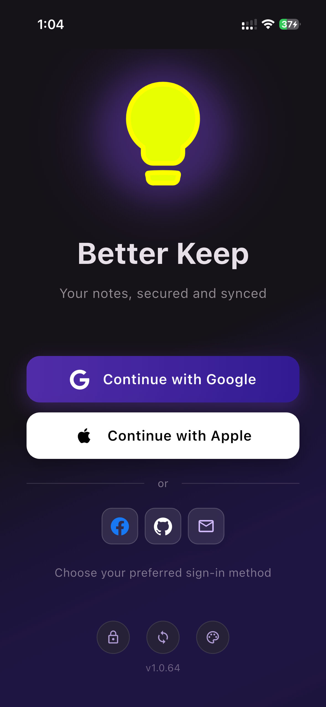
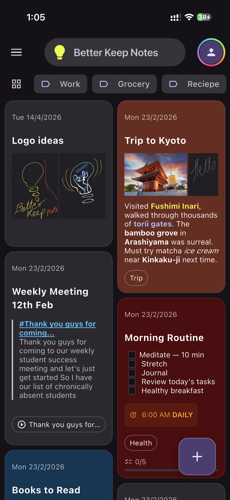
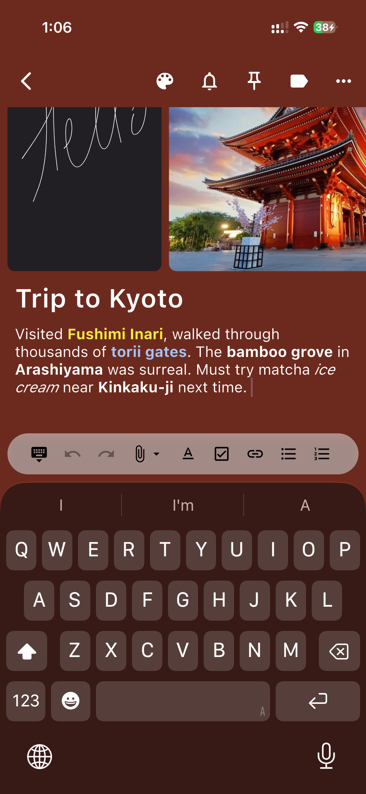

# Better Keep 

[](https://github.com/foxbiz/better-keep)  [](https://apps.apple.com/us/app/better-keep-notes/id6759548198)   

[](https://play.google.com/store/apps/details?id=io.foxbiz.better_keep) [](https://apps.apple.com/us/app/better-keep-notes/id6759548198) [](https://betterkeep.app)

[](https://apps.microsoft.com/detail/9PHT5C6WK6Q1)

Better Keep is my take on the notes app I always wanted Google Keep to be. It keeps the familiar card-based experience, then layers on richer writing, better organization, and privacy controls while staying lightning fast and offline friendly.

## Why build it?

- Google Keep is great but misses power features I rely on for project planning and journaling.
- I wanted rich-text notes, better bulk actions, and real locking with encryption without leaving the Keep workflow.
- Flutter lets me reach mobile, desktop, and web with one codebase, so the app can live everywhere I take notes.

## Highlights for everyone

- **Rich-text editor** powered by `flutter_quill` with headings, lists, formatting, and color-coded backgrounds.
- **True offline mode** backed by SQLite across desktop, mobile, and web (where supported).
- **Secure notes**: lock individual notes with a PIN; content is encrypted before hitting disk.
- **End-to-end encryption**: notes and attachments are encrypted on your device before syncing. The server never sees your plaintext data.
- **Organize faster**: labels, quick filtering, instant search, and a masonry layout that keeps pinned notes up front.
- **Smart views & folders**: switch between grid, list, and folder views. Organize notes hierarchically by labels or colors with breadcrumb navigation.
- **AI audio transcription**: record voice memos and get automatic transcription using on-device Whisper AI. Your audio stays private while being converted to searchable text.
- **Share to app**: receive shared text and files from other apps to quickly capture content.
- **Stay tidy**: archive or trash in bulk, restore when needed, or delete forever with one tap.
- **Full sync**: notes, attachments, and labels sync across devices with live updates.
- **Sketch with images**: the sketch page now supports adding images for annotation.
- **Audio transcription**: record audio notes and get automatic transcription.

## Platforms

Available on **Android**, **iOS**, **macOS**, **Windows**, and **Web**.

## Under the hood (developer notes)

- Flutter 3.10+ with a lightweight global `AppState` pub/sub instead of heavy state frameworks.
- Persistent storage via `sqflite` (and `sqflite_common_ffi` for desktop) with thin model layers in `lib/models`.
- Rich editor and previews courtesy of `flutter_quill`; read-only rendering reuses the same deltas.
- AES-256-GCM protection for PIN-locked notes, with legacy XOR decryption retained only to migrate older data (`lib/utils/encryption.dart`).
- Responsive masonry grid (`lib/pages/home/notes.dart`) that adapts to any screen width and remembers scroll position.

## Screenshots

| Login                                 | Home                                  | Editor                                |
| ------------------------------------- | ------------------------------------- | ------------------------------------- |
|  |  |  |

## Try it quickly

```bash
git clone https://github.com/foxbiz/better-keep.git
cd better-keep
flutter pub get
```

### Running the app

The app requires environment variables defined in a `.env` file. Create one at the project root with your configuration:

```bash
# .env example
# Add your Firebase and app configuration here
# FIREBASE_API_KEY=your_api_key
# FIREBASE_PROJECT_ID=your_project_id
#
# Optional per-platform Firebase Auth domain override. Hosted OAuth callbacks
# default to the branded betterkeep.app domain.
# ANDROID_AUTH_DOMAIN=betterkeep.app
# IOS_AUTH_DOMAIN=betterkeep.app
# MACOS_AUTH_DOMAIN=betterkeep.app
# WEB_AUTH_DOMAIN=betterkeep.app
# WINDOWS_AUTH_DOMAIN=betterkeep.app
#
# Web storage encryption key (64-char hex string, 256 bits)
# Generate with: openssl rand -hex 32
# WEB_STORAGE_KEY=<your-64-char-hex-key>
#
# Required for physical Android/iOS devices in emulator mode.
# Optional remote/LAN override for desktop clients; same-machine desktop
# clients default to 127.0.0.1.
# EMULATOR_HOST=192.168.1.25
```

**Using VS Code:**

Open the project in VS Code and use the pre-configured launch configurations in `.vscode/launch.json`:

- `better_keep` – Debug mode
- `better_keep (Profile)` – Profile mode for performance analysis
- `better_keep (Release)` – Release mode
- `better_keep (Web Server)` – Run as web server on port 63630

All configurations automatically load environment variables from `.env` via `--dart-define-from-file`.

**Using the terminal:**

```bash
npm run dev android
npm run dev ios
npm run dev macos
npm run dev web
npm run dev windows
```

- Run `npm run dev` to list the supported platforms.
- Android and iOS automatically use the only matching device or prompt when
  several are connected. Override the choice with
  `npm run dev android -- -d <device-id>`.
- Desktop builds require `sqflite_common_ffi`; the app auto-initializes it on Windows/macOS.

### Firebase emulator testing

Normal repository development uses Node `24.18.0` LTS. Firebase Functions and
the Firebase CLI use a companion Node `22.23.1`, while Java-backed emulators use
companion Temurin Java `21.0.11`. Install all three runtimes once:

```bash
nvm install 24.18.0
nvm install 22.23.1
sdk install java 21.0.11-tem
```

Install both the root and Functions dependencies once:

```bash
npm install
npm run functions install
```

The repository wrappers discover the exact companion runtimes and use them only
for their child processes. Your active Node and Java versions are not changed,
and normal commands do not require `nvm use 22.23.1`, `sdk use`, or `sdk env`.
The wrappers fail with installation-only remediation if a companion is missing,
and invoke the locally pinned `firebase-tools`, never an accidental global CLI.
Java is selected only for emulator commands that start Firestore, Realtime
Database, or Storage.

NVM and SDKMAN installations are discovered automatically. CI or non-standard
installations can provide absolute paths with
`BETTER_KEEP_FIREBASE_NODE_BIN` and `BETTER_KEEP_FIREBASE_JAVA_HOME`.
Use `npm run firebase runtime-check` or
`npm run firebase emulator-runtime-check` to see the selected host and Firebase
runtimes.

For a physical Android or iOS device, set `EMULATOR_HOST` in `.env` to the
computer's current LAN address. Desktop clients use `127.0.0.1` by default;
set `EMULATOR_HOST` only when the emulators run on another computer. Then start
the complete emulator suite:

```bash
npm run firebase emulators
```

The tracked `firebase.emulators.json` binds Auth (`9099`), Firestore (`8080`),
Functions (`5001`), Hosting (`5002`), Storage (`9199`), and the Emulator UI
(`4000`) to the LAN. Only run this command on a trusted network because Firebase
emulators do not protect local data like production services.

On every debug launch, select **Emulator** or **Live**. The chooser remembers
the emulator host and Google OAuth preference, but always asks which Firebase
environment to use before dependent services initialize. Android emulators
automatically use `10.0.2.2`; Apple simulators and same-machine desktop clients
use `127.0.0.1`; physical devices require the editable `EMULATOR_HOST` value.
Desktop clients can also use `EMULATOR_HOST` as a remote/LAN override. A
physical device and the computer must be on the same Wi-Fi, and the host
firewall/router must allow the ports above. The app checks every required
service and reports the exact unavailable ports without falling back to
production.

After routing succeeds, every debug screen shows a red **LIVE FIREBASE** or
amber **EMULATOR** ribbon. Tap it for the committed app name, project, database,
service endpoints, and local-data scope. Settings shows the same routing as
read-only status; changing environments requires the next debug restart.

Live retains the legacy `better_keep.db`, file roots, preferences, and secure
storage keys. Emulator uses `better_keep_emulator.db` plus isolated file,
preference, E2EE, and OAuth namespaces, so the first emulator launch starts
with a clean local cache. After installing this routing change, fully stop the
old app process once before testing because its default native Firebase app may
already have been routed to emulators.

Google login uses a deterministic `google.com` emulator identity by default, so
it works without internet. Enable **Use real Google OAuth** in the chooser only
when testing the external Google flow. Prepare and test the email/password
review account using `docs/GOOGLE_PLAY_REVIEW_ACCOUNT.md`.

Run the emulator configuration tests with:

```bash
npm test firebase-emulator-config
```

Run the Functions cleanup and trigger tests in isolated Firestore and Storage
emulators with:

```bash
npm test firebase-emulator-functions
```

Run the Firestore and Storage security-rules suite together, then exercise the
managed review token directly against Auth, Functions, Firestore, and Storage:

```bash
npm test firebase-rules
npm test firebase-emulator-review
```

With the emulators running, exercise Auth, Functions, Firestore, Storage, and
Hosting from a connected Android target:

```bash
npm test firebase-emulator-android -- -d <device-id>
npm test firebase-environment-android -- -d <device-id>
```

### Building the app

Build release versions for distribution:

**Android:**

```bash
# APK (universal)
flutter build apk --dart-define-from-file=.env

# App Bundle (recommended for Play Store)
flutter build appbundle --dart-define-from-file=.env
```

**iOS:**

```bash
flutter build ios --dart-define-from-file=.env
```

Then open `ios/Runner.xcworkspace` in Xcode to archive and distribute.

**macOS:**

Prepare Flutter's generated Swift package before using Xcode Organizer:

```bash
npm run build macos-xcode
```

Then open `macos/Runner.xcworkspace` and select **Product → Archive**. Run the
preparation command again after `flutter clean`, `flutter pub get`, dependency
changes, or deployment-target changes so Xcode does not resolve Flutter's
generated package with its default macOS 10.15 target.

For a normal command-line release build, run `npm run build macos`. The app will
be at `build/macos/Build/Products/Release/Better Keep Notes.app`.

**Windows:**

```bash
npm run build windows
```

Run `flutter --version` from the same terminal first so Flutter is available on
Windows `Path`. The command builds the release application, then creates its
MSIX package. The unpackaged app will be at
`build/windows/x64/runner/Release/`.

<!-- Linux build disabled - Firebase doesn't support Linux yet
**Linux:**

```bash
flutter build linux --dart-define-from-file=.env
```

The app will be at `build/linux/x64/release/bundle/`.
-->

**Web app and static marketing site:**

```bash
npm run build web
```

This builds the indexable Astro marketing site at `/`, embeds Flutter Web at
`/app/`, and validates the complete Firebase Hosting artifact in `build/web/`.
Deploy that artifact to Firebase Hosting with:

```bash
npm run deploy hosting
```

The Hosting deployment always rebuilds the web application first.

### Checks and release gate

Use the grouped checks for analysis, dependency auditing, and the secret-backed
Apple Firebase configuration:

```bash
npm run check analyze
npm run check audit
npm run check apple-config
npm run check commit
```

Run `npm run check` to list the available checks. The Apple configuration check
requires `.env` and `macos/Runner/GoogleService-Info.plist`.

Run the complete portable release gate with:

```bash
npm run release
```

The gate runs `npm run check analyze`, then `npm test release`, stopping on
failure. CI uses this same command for pull requests, tags, and manual runs.
Dependency audits are invoked manually with `npm run check audit` (root and
Functions) or `npm run functions audit` (Functions only); they are not part of
the release gate. Dependency installation may still print advisory summaries.

The gate requires `flutter` and `npm` on `Path`. Its browser acceptance stage
also requires Google Chrome plus a version-matched `chromedriver` executable.
Download matching releases from the [Chrome for Testing availability
dashboard](https://googlechromelabs.github.io/chrome-for-testing/).

Use `npm run release help` to display its fail-fast sequence without running it.

Enable the tracked local commit gate once per clone:

```bash
git config core.hooksPath .githooks
```

Every `git commit` runs `npm run check commit`, selecting components from staged
changes. Each affected component runs once:

| Component | Local commit checks |
| --- | --- |
| Flutter | `flutter analyze --no-pub` and the complete local unit/widget suite |
| Functions | Existing compilation, script type checks, and unit tests |
| Admin and marketing | Each affected workspace's Astro/TypeScript check and local tests |
| Tooling | Local Node tests |

Source, test, configuration, and dependency files select their owning component.
Root npm dependency/runtime changes select tooling and both web workspaces.
Documentation-only commits skip code checks; marketing content under `site/src`
is treated as application content. Renames and deletions also select affected
components.

Formatting checks read staged Dart files and Functions source files covered by
Biome, excluding generated files. They never rewrite or stage files: failures
show a fix command so you can review and stage the result. Analysis and tests
run against the current working tree. Install the component's dependencies first;
the hook does not install packages or update lockfiles.

Dependency audits, browser/emulator/device tests, and release builds are not part
of local commit checks. Functions compilation is retained because its unit tests
use compiled JavaScript. The complete release gate remains available through
`npm run release` and continues to run in CI.

For an exceptional commit that must bypass the local checks, use
`git commit --no-verify` and run the appropriate checks manually.

## Source license

The repository is **source-available under CC BY-NC 4.0**. The non-commercial
restriction means it is not described as OSI-approved open source.

## Project layout

```text
lib/
  app.dart               # MaterialApp, localization, theming
  config.dart            # App configuration and constants
  main.dart              # DB bootstrapping and platform init
  state.dart             # Global event-driven state store
  models/
    base_model.dart      # Base class for all models
    note.dart            # Note schema with sync support
    label.dart           # Label schema
    note_attachment.dart # Base attachment model
    note_image.dart      # Image attachment model
    note_recording.dart  # Audio recording with transcription
    sketch.dart          # Sketch/drawing data
    reminder.dart        # Reminder/alarm model
    *_sync_track.dart    # Sync tracking for notes, labels, files
  pages/
    home/                # Masonry feed, sidebar, labels, search
    note_editor/         # Rich-text editor, toolbar, actions
    sketch_page.dart     # Sketch editor with image support
    image_viewer.dart    # Full-screen image viewer
    login_page.dart      # Authentication UI
    user_page.dart       # User profile and settings
    settings.dart        # App settings
    nerd_stats_page.dart # Usage statistics
  services/
    database.dart        # SQLite database management
    auth_service.dart    # Firebase authentication
    note_sync_service.dart   # Note sync with Firestore
    label_sync_service.dart  # Label sync with Firestore
    file_system.dart     # Cross-platform file handling
    alarm_id_service.dart    # Reminder/alarm management
  components/            # Reusable UI (note card, animated icons, etc.)
  dialogs/               # Prompt, confirm, color picker, label manager
  themes/                # Dark theme configuration
  ui/                    # UI utilities and widgets
  utils/                 # Encryption, helpers, utilities
assets/
  sounds/                # Audio files for alarms/notifications
  ...                    # Fonts, images, lottie, etc. (see `pubspec.yaml`)
```

## Local data model

- **`note`** table: title, rich-text JSON content, labels (comma separated), color, archival flags, timestamps, lock metadata, sync status.
- **`label`** table: user-managed labels with conflict-safe upserts and sync tracking.
- **`note_image`** table: image attachments linked to notes with local/remote paths.
- **`note_recording`** table: audio recordings with transcription text and duration.
- **`sketch`** table: drawing data with stroke information and background images.
- **`reminder`** table: scheduled reminders with alarm support.
- **`*_sync_track`** tables: track sync state for notes, labels, and files.
- Locked notes store encrypted content; unlocking decrypts in-memory only.

## Sync & Conflict Resolution

Better Keep implements a robust **Local-First** sync strategy using Firebase Firestore and Storage with **live syncing** capabilities.

### What Syncs

- **Notes**: Full note content, metadata, and settings.
- **Labels**: User-created labels sync across all devices.
- **Attachments**: Images, audio recordings, and sketches.

### Live Sync

The app listens to Firestore in real-time. Changes made on one device appear on other devices within seconds, without requiring manual refresh.

### Sync Policy: "Newest Wins"

To ensure data integrity across devices, the app uses a timestamp-based conflict resolution strategy:

1.  **Pushing Changes**:
    - Before pushing a local update to the cloud, the app fetches the current remote version.
    - **Comparison**: It compares the `updatedAt` timestamp of the local item against the remote.
    - **Resolution**:
      - If **Remote is Newer**: The push is aborted. The local item is immediately updated with the newer remote data (effectively a "pull" operation).
      - If **Local is Newer**: The local changes are pushed to Firestore, overwriting the older remote version.

### Duplicate Prevention

- **Local IDs**: Each note and label maintains a `local_id` which is synced to Firestore.
- **Re-installation**: If the app is re-installed or the local database is cleared, the sync process uses the `local_id` from Firestore to map remote items back to the correct local records, preventing duplicate entries.

### Storage & Attachments

- **Full Attachment Sync**: Images, audio recordings (with transcriptions), and sketches are synced to Firebase Storage.
- **Recursive Deletion**: When a note is deleted, a recursive cleanup process ensures all associated files are permanently removed from Firebase Storage.
- **Offline Support**: Attachments are downloaded locally. The app prefers local files when available and syncs new attachments in the background.
- **File Sync Tracking**: A dedicated tracking system ensures attachments are properly synced and handles retries for failed uploads.

## Development workflows

### Firebase Setup (Required for Sync)

This project uses Firebase for sync and authentication. Since `firebase_options.dart` is git-ignored for security, you must configure your own Firebase project:

1.  Install the host and companion runtimes described in
    **Firebase emulator testing**, then run `npm install` and
    `npm run functions install`.
2.  Install the matching global Firebase CLI for FlutterFire CLI discovery:
    `npm install -g firebase-tools@15.24.0`. Repository scripts still invoke
    only the pinned local CLI.
3.  Log in: `npm run firebase login`
4.  Activate FlutterFire CLI: `dart pub global activate flutterfire_cli`
5.  Configure the app:

    ```bash
    flutterfire configure
    ```

    - Select your Firebase project (or create a new one).
    - Select the platforms you want to support (Android, iOS, Web, macOS, Windows).
    - This will generate `lib/firebase_options.dart`.

6.  Enable **Authentication** (Google Sign-In) and **Firestore Database** in your Firebase Console.

- `flutter pub get` – install dependencies.
- `flutter analyze` – static analysis.
- `dart format lib test` – keep style consistent.
- `flutter test` – run widget and unit tests (extend coverage as features grow).

## Roadmap

- [x] End-to-end encryption (E2EE) for notes and attachments. See [E2EE Documentation](docs/E2EE.md).
- [x] Light and dark theme support.
- [x] Fix alarm notifications on iOS.
- [x] Optimize sketch saving (reduce file size by lowering precision).
- [x] Revenue model implementation.
- [x] Smart views & folders (grid, list, folder views with hierarchical organization).
- [x] AI audio transcription using on-device Whisper.
- [x] Share to app (receive shared content from other apps).
- [x] Adaptive toolbar with responsive icon sizing.
- [ ] Calendar-grade reminders and recurring nudges.
- [ ] Widgets and quick actions on mobile/desktop.
- [ ] Theme editor (custom colors).

## Contributing & feedback

- Issues and feature requests welcome via GitHub.
- Fork, branch (`git checkout -b feature/<name>`), add tests, and open a PR once `flutter analyze` and tests pass.
- Reach out in Discussions if you want to coordinate on a larger feature.

## License

This project is licensed under the **Creative Commons Attribution-NonCommercial 4.0 International Public License (CC BY-NC 4.0)**.

You are free to:

- **Share** — copy and redistribute the material in any medium or format.
- **Adapt** — remix, transform, and build upon the material.

Under the following terms:

- **Attribution** — You must give appropriate credit, provide a link to the license, and indicate if changes were made.
- **NonCommercial** — You may not use the material for commercial purposes.

See the [LICENSE](LICENSE) file for details.
